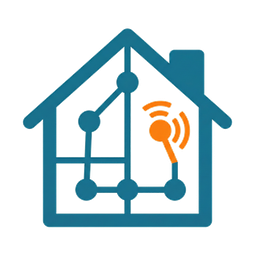

# TopoMation



[](https://github.com/hacs/integration)
[](https://analytics.home-assistant.io/custom_integrations.json)
[](https://github.com/mjcumming/topomation/releases)
[](https://github.com/mjcumming/topomation/actions/workflows/frontend-tests.yml)
[](https://github.com/mjcumming/topomation/blob/main/LICENSE)
[](https://github.com/mjcumming/topomation)

**Whole-home occupancy automation for Home Assistant, built around locations instead of automation sprawl.**

TopoMation lets you model your home as a hierarchy, assign detection sources and devices to each location, and generate native Home Assistant automations for lighting, appliances (standalone `fan.*` and `switch.*`), media, and HVAC (climate-linked `fan.*`). It is designed for people who want occupancy automation that stays understandable when it grows past a few rooms.

## Why this exists

Home Assistant gives you great primitives, but whole-home occupancy automation usually turns into:

- too many per-room automations
- duplicated timeout and darkness logic
- no concept of room hierarchy or subareas
- hard-to-debug behavior spread across YAML, helpers, and UI automations

TopoMation gives you one place to define:

- where a location sits in your home
- which entities can imply occupancy there
- how long that occupancy should hold
- what should happen when the location becomes occupied, vacant, dark, or bright

## What makes it different

### A real location tree

You can model buildings, grounds, floors, rooms, and subareas such as closets or pantries. Occupancy rolls up through the tree, so you can tell at a glance whether a room, floor, or the whole home is occupied.

### One occupancy signal per location

Motion sensors, door contacts, mmWave sensors, cameras, switches, media devices, and other entity state changes can all contribute to one stable occupancy state for a location.

### Native Home Assistant automations

Managed rules are stored as Home Assistant automations. They appear in `Settings -> Automations & Scenes`, produce traces, and stay debuggable with normal HA tools.

### Better support for awkward real houses

TopoMation handles the cases that usually become custom automation debt:

- subareas with different timeouts
- open-plan spaces that should stay in sync
- lux-driven `dark` / `bright` logic
- room or subtree lock modes for party mode, testing, or away workflows

## How it works

1. Import your existing Home Assistant floors and areas.
2. Organize them into a deeper tree with optional `building`, `grounds`, and `subarea` nodes.
3. Assign occupancy sources and device targets to each location.
4. Configure `Occupancy` and `Ambient`.
5. Add rules in `Appliances`, `HVAC`, `Lighting`, and `Media`.

After that, TopoMation maintains occupancy entities and managed automations from the location model.

Each configured occupancy source contributes independently. If you add both a
presence sensor and a motion sensor to one location, either source can keep the
room occupied until its own contribution clears or expires. Use only the
presence source if you want presence to be authoritative for that room.

## Quick examples

### Closet light

- Create `Closet` as a subarea under the bedroom.
- Add the closet motion sensor as a detection source.
- Set a 5 minute timeout.
- Add a lighting rule for `On occupied` -> turn on the closet light.
- Add a lighting rule for `On vacant` -> turn off the closet light.

### Bathroom with no dedicated sensor

- Use the bathroom light switch as a detection source.
- Set a 20 minute timeout.
- Add `On vacant` rules for the light and exhaust fan.

The switch interaction becomes the occupancy signal. No extra hardware required.

### Open-plan kitchen and living room

- Keep both rooms as separate locations.
- Sync them so occupancy and vacancy resolve together.
- Add lighting rules per room, but share occupancy timing.

## Feature highlights

- Hierarchical location model: `building`, `grounds`, `floor`, `area`, `subarea`
- Drag-and-drop reorganization
- Per-location occupancy entities
- Multi-source occupancy fusion with configurable timeouts
- Ambient light support with lux sensors and sun fallback
- Native HA-managed rules for lighting, appliances, media, and HVAC
- Manual trigger, clear, vacate, lock, and unlock services
- Lock scopes for a single location or an entire subtree
- Occupancy Explainability in the panel: a short summary of why each location is occupied or vacant and what changed recently (not a full HA logbook)

### Occupancy and your automations

Managed rules (for example **Lighting** with `On occupied` and `On vacant`) are normal Home Assistant automations. They react to each location’s **occupancy binary sensor** (and any ambient or time conditions you configured)—the same fused state you set up under the **Occupancy** tab, including sources, timeouts, sync, and locks.

Use **Occupancy Explainability** when you want a quick read on contributors and recent context. For a complete timeline or deep debugging, use HA **History**, **Logbook**, and automation **Traces**; the explainability list is intentionally brief and may roll together repeated “still occupied” activity so fast bursts stay readable.

## Installation

### HACS

1. Open **HACS** in Home Assistant.
2. Add `https://github.com/mjcumming/topomation` as a custom integration repository.
3. Install **TopoMation**.
4. Restart Home Assistant.
5. Add the integration in **Settings -> Devices & Services**.

Full guide: [docs/installation.md](docs/installation.md)

## First 10 minutes

1. Open the **TopoMation** sidebar panel.
2. Review the imported floors and areas.
3. Add any missing structural nodes such as `building`, `grounds`, or `subarea`.
4. Select a room and configure the `Occupancy` tab.
5. Configure `Ambient` if you want dark/bright-aware behavior.
6. Add at least one rule in `Appliances`, `HVAC`, `Lighting`, or `Media`.
7. Trigger the room and confirm the generated automation appears in Home Assistant.

## Services

| Service | Purpose |
| --- | --- |
| `topomation.trigger` | Mark a location occupied |
| `topomation.clear` | Release one occupancy contribution |
| `topomation.vacate` | Force a single location vacant |
| `topomation.vacate_area` | Vacate a location and its descendants |
| `topomation.lock` | Apply an occupancy lock policy |
| `topomation.unlock` | Remove one lock source |
| `topomation.unlock_all` | Remove all lock sources |

Lock workflows: [docs/occupancy-lock-workflows.md](docs/occupancy-lock-workflows.md)

## Current status

TopoMation is in **alpha**. The core occupancy model, source handling, timeout behavior, lock workflows, and managed-automation generation are in active use and covered by tests, but the project is still tightening UX, documentation, and release validation.

You should expect:

- occasional UI and workflow changes
- some rough edges in onboarding copy
- more design polish before broader promotion

## Known limitations

- Ambient sensor assignment is explicit; there is no automatic lux discovery.
- Admin access is required for panel routes and managed automation writes.
- `Appliances`, `Media`, and `HVAC` are intentionally narrower than unrestricted HA automation editing.
- Rich `climate.*` thermostat workflows are intentionally deferred.

## Documentation

User-facing:

- [docs/installation.md](docs/installation.md)
- [docs/occupancy-lock-workflows.md](docs/occupancy-lock-workflows.md)

Project and architecture:

- [docs/architecture.md](docs/architecture.md)
- [docs/contracts.md](docs/contracts.md)
- [docs/automation-ui-guide.md](docs/automation-ui-guide.md)
- [docs/index.md](docs/index.md)

## Development

```bash
git clone https://github.com/mjcumming/topomation
cd topomation
make dev-install
make test
```

### Dev container HA workflow

```bash
cd /workspaces/topomation
make test-ha-up
make test-ha-status
make test-ha-check
```

- Open `http://localhost:8123` and validate changes in the TopoMation panel.
- Restart after backend edits: `make test-ha-restart`
- Tail logs while testing: `make test-ha-logs`
- Shut down when done: `make test-ha-down`

Runbook: [tests/DEV-CONTAINER-HA.md](tests/DEV-CONTAINER-HA.md)

## Support

- [Issues](https://github.com/mjcumming/topomation/issues)
- [Discussions](https://github.com/mjcumming/topomation/discussions)

## License

MIT. See [LICENSE](LICENSE).
