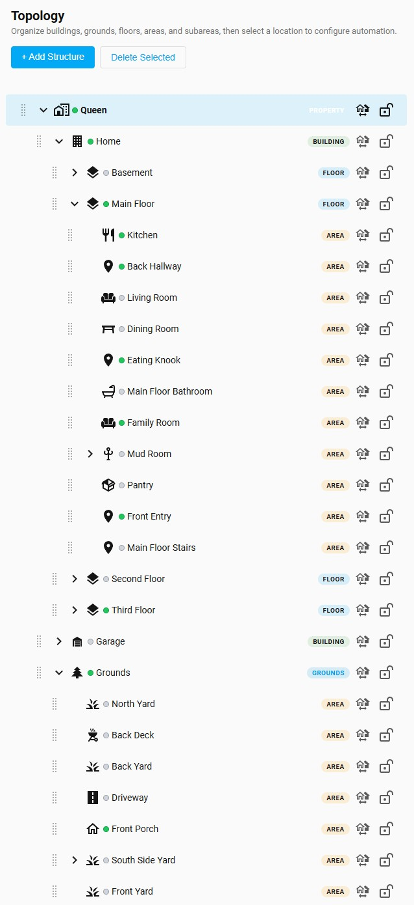
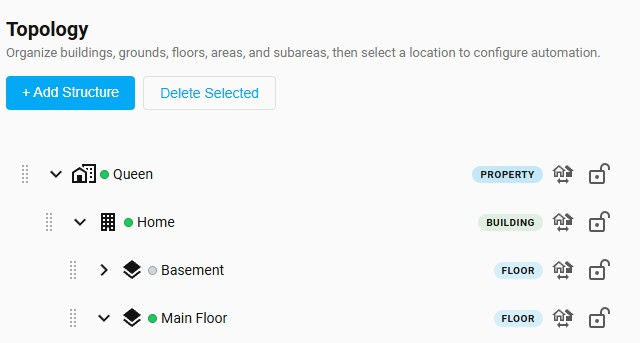
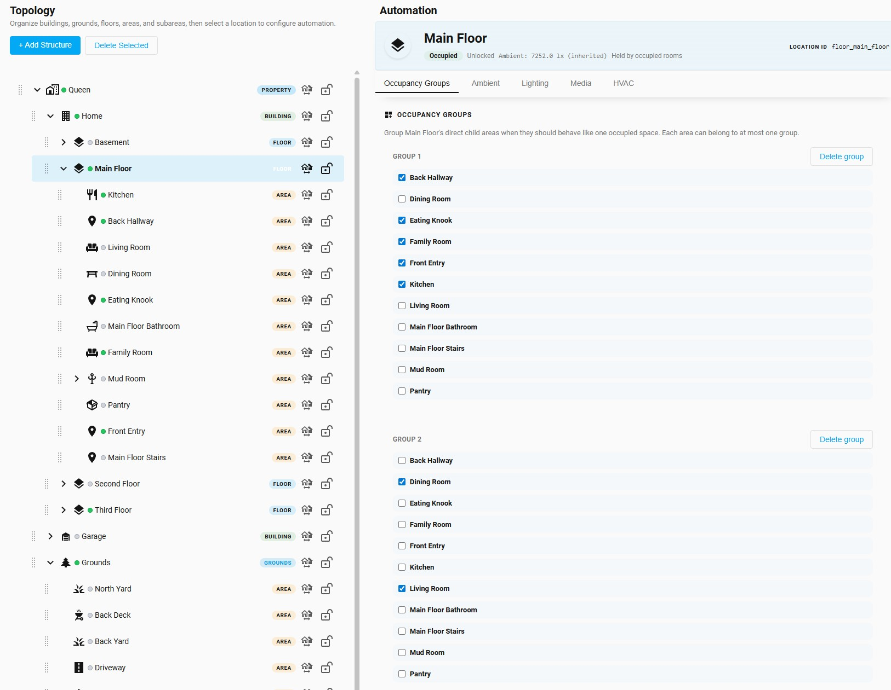
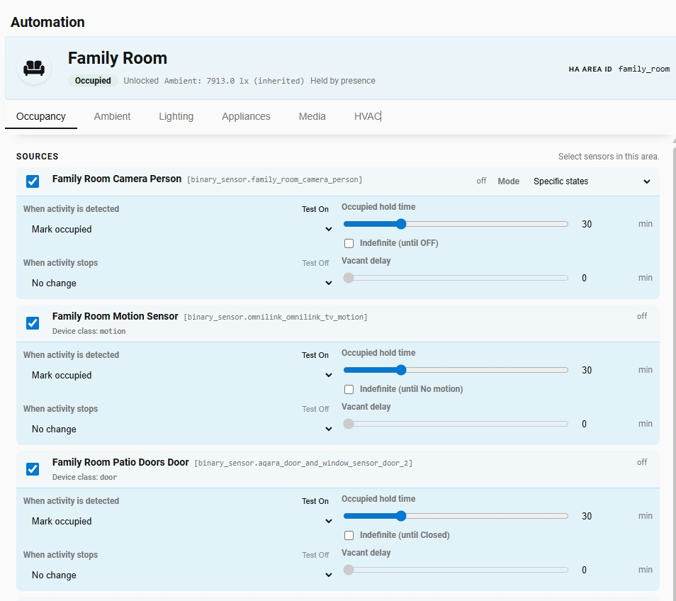
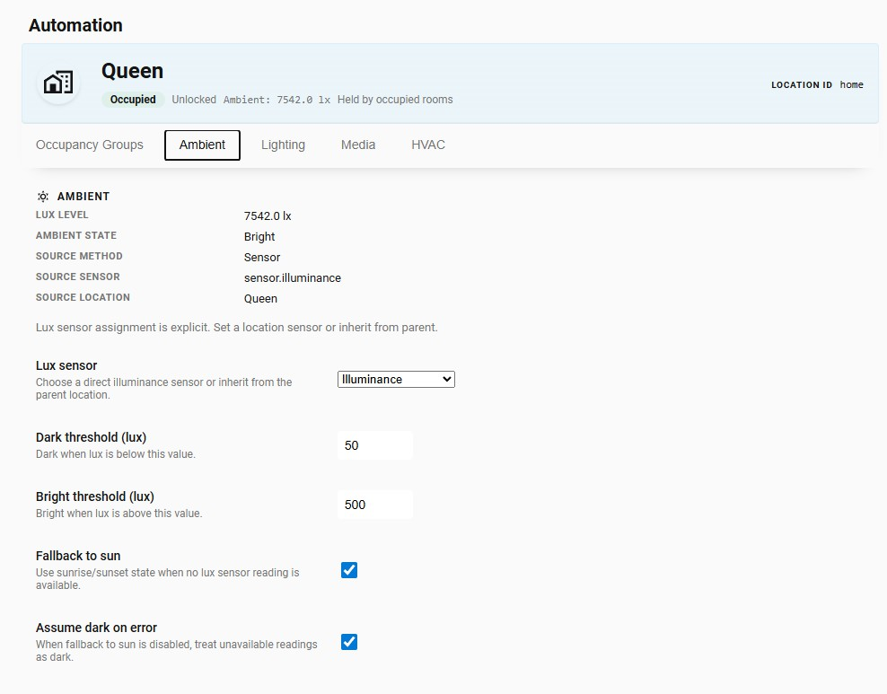
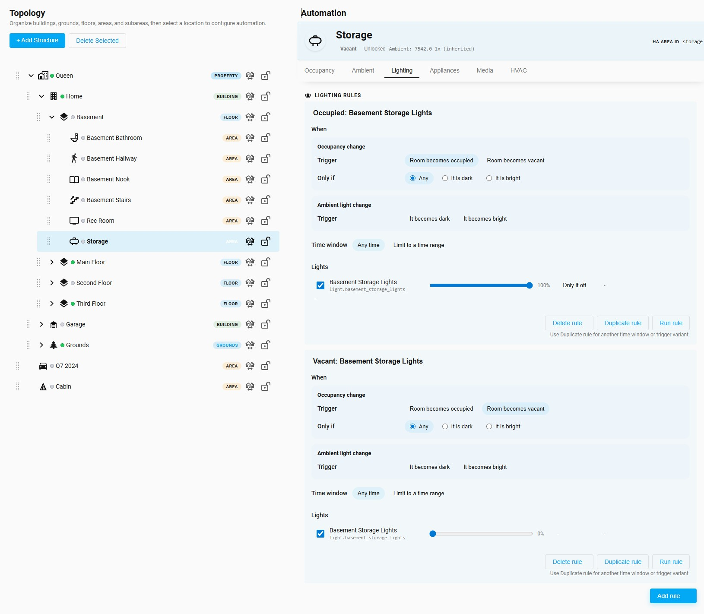

# TopoMation


[](https://github.com/hacs/integration)
[](https://analytics.home-assistant.io/custom_integrations.json)
[](https://github.com/mjcumming/topomation/releases)
[](https://github.com/mjcumming/topomation/actions/workflows/frontend-tests.yml)
[](https://github.com/mjcumming/topomation/blob/main/LICENSE)

> TopoMation is a one-person beta project. It started as occupancy automation for my own two homes and I'm sharing it because I think other people will find it useful. There's no company behind it and no roadmap. The core has been through a lot of testing and runs in my houses every day, but expect some rough edges, and I can't promise turnaround on issues or feature requests. If that trade-off is fair to you, the rest of this explains what it does.

TopoMation is a Home Assistant integration for occupancy-driven automation across a whole house. You arrange your home as a hierarchy (properties, buildings, grounds, floors, and areas), assign the sensors that imply someone is around, and let it generate the lighting, fan, media, and HVAC automations from there.

Anyone who's spent time with Home Assistant has bumped into the limits of its area model. Areas are flat, floors are little more than a label, and a device that belongs to a whole floor or a building has nowhere natural to live. TopoMation sits on top of your existing floors and areas and adds the structural model HA is missing: a real hierarchy where every level is a real place, and devices can attach at any of them, not just to rooms. From there, configuration is point-and-click in the panel. No YAML, no automation rules to design and remember. The rules it generates are normal Home Assistant automations you can open, read, and trace, not a hidden box.

In practice, here's what's different about a TopoMation-driven house:

- **Every level of your home has its own occupancy entity.** "Is anyone home", "is anyone upstairs", "is anyone outside" are each a single HA binary sensor you can use as a trigger. Vanilla HA can't give you that.
- **Lights, fans, and TVs all respond to who's actually in the room.** One configuration per location, no per-room automations to maintain.
- **Sensors stop fighting you.** Multiple occupancy sources can fuse per room with independent timing, plus optional wasp-in-a-box inference for rooms with a door and an interior sensor. Rooms stay occupied while you're sitting still.
- **Hold a room's state when you need to.** Click the lock icon on a row to freeze that location and its subtree. Useful for keeping lights on during a party or stopping things from triggering while you're testing.
- **Reorganize a room or swap a sensor in one place.** The rules regenerate. You don't go hunting through twenty automations.
- **Open-plan rooms and outdoor space work the same way.** A kitchen flowing into the family room can behave as one space. Driveway, porch, and yard use the same rule types as rooms.

## The tree



The hierarchy is the central idea. TopoMation imports your existing HA floors and areas and wraps them in a deeper structure: a `property` at the top, one or more `building`s, `floor`s, the `area`s HA already knows about, and `subarea`s for things like closets and pantries. There's also `grounds` for outdoor space.

Each row in the tree exposes a few controls. The drag handle on the left reorders and re-parents. The dot next to the name turns green when the location is occupied and gray when vacant. On the right, a **manual occupancy toggle** sets the location occupied or vacant by hand (useful for testing rules), and a **lock icon** holds the location's state across itself and its descendants.



Occupancy rolls up the tree, and every level has its own HA binary sensor. If anyone's in the kitchen, the main floor's sensor reads occupied. If anyone's anywhere indoors, the building's sensor reads occupied. If anyone's anywhere on the property at all, indoor or out, the property's sensor reads occupied. These are real entities you can use as triggers in any other HA automation, which is something you can't get out of the flat HA area model on its own.

Every non-area level is also a real place to attach devices. TopoMation backs each one with an HA area (a *shadow area*) so a building-wide alarm panel, a floor-level thermostat, or pool equipment on the grounds has somewhere to live that isn't a single room.

For open-plan houses where adjacent rooms behave as one space (kitchen flowing into family room, say), there are **occupancy groups**: at any parent location, group its children so they share an occupied/vacant state.



## Occupancy from anything



The most common reason a room misbehaves with occupancy automation is having only one signal driving it. TopoMation handles as many independent sources per location as you want. Almost any HA entity qualifies: PIR motion, mmWave / presence, door and window contacts, cameras with person detection, light or fan switch state (for rooms with no dedicated sensor), media players, or arbitrary state changes you want to count.

Each source on a location is independent. It has its own occupied hold time, its own vacant delay, and an optional indefinite mode that keeps the room occupied until that source's underlying entity returns to idle ("until OFF", "until No motion", "until Closed"). So a presence sensor can hold a room indefinitely while a door contact only contributes for a few minutes after it last triggered. The room stays occupied as long as *any* source is holding it, and goes vacant when they've all cleared.

For rooms with a door and an interior sensor, you can turn on **wasp-in-a-box** inference, which uses the door's open and close events as boundary crossings and keeps the room occupied while someone is in it, even when the motion sensor goes quiet. It's the actual answer to "the sensor went vacant while I was sitting still."

This is the part that pays off most in awkward real houses: bathrooms with no motion sensor (use the light switch), pantries that need a 30-second hold (door contact, no delay), bedrooms where presence should win over motion at night.

## Ambient light



Lighting rules can fire only when the room is dark, so the kitchen overhead doesn't slam on at noon and the living room lamps come on at dusk without a time-based trigger. Each location has a `dark` / `bright` state derived from a lux sensor, with configurable thresholds and inheritance from parent locations. Put one outdoor lux sensor on `grounds` and let it apply to the whole property; override at the room level if a specific room needs different thresholds. If no lux reading is available, there's an optional fallback to sunrise/sunset, plus an "assume dark on error" toggle.

## What you can automate



Rules live in four categories on each location:

- **Lighting**: turn on/off and set brightness on occupancy or ambient changes
- **Appliances**: standalone fans and switches (exhaust fans, heaters, anything driven by `fan.*` or `switch.*`)
- **HVAC**: `fan.*` entities linked to a climate device
- **Media**: pause, play, mute on occupancy changes

Each rule binds to a trigger (room becomes occupied/vacant, or ambient becomes dark/bright), an optional time window, and target entities. The lighting rule shown above fires when the storage room becomes occupied and it's dark. The paired vacant rule turns it off again.

A few examples to make this concrete:

**Closet light.** Add the closet as a subarea under the bedroom, point its occupancy at the closet motion sensor with a 5-minute hold, add lighting rules for occupied (on) and vacant (off).

**Bathroom with no dedicated sensor.** Use the bathroom light switch's `on` state as the occupancy source with a 20-minute hold. Add vacant rules for the light and the exhaust fan. The switch interaction *is* the signal, no extra hardware needed.

**Open-plan kitchen and family room.** Keep them as separate locations so per-room rules still work, but put both into one occupancy group on their parent floor so they go vacant together.

The full enumeration of rule options per category is in [docs/automation-ui-guide.md](docs/automation-ui-guide.md).

## Locking

Sometimes you want occupancy to *not* react. Locking a location holds its state across itself and its subtree, so a vacancy timeout doesn't kill the lights mid-party and a stray sensor reading doesn't trigger anything while you're out.

The primary way to lock or unlock is the **lock icon** on the row in the tree. One click locks the row and its descendants, another click unlocks. The icon shows the current state, and the tooltip lists whatever sources are currently holding the lock.

Each location also exposes a `switch.<location>_lock` entity. Turning it on locks the location with `freeze + subtree`; turning it off force-clears every lock source (matching the tree icon's unlock behavior). Drop it into a Lovelace card, a scene, a voice routine, or a UI-built automation when you don't want to write a service call.

For automation-driven cases that need a specific mode, the integration exposes services: `topomation.lock`, `topomation.unlock`, and `topomation.unlock_all`. They take a `location_id`, a `source_id`, a `mode` (`freeze`, `block_occupied`, or `block_vacant`), and a `scope` (`self` or `subtree`). Multiple automations can hold a lock at the same time as long as each uses its own `source_id`. Full reference in [docs/occupancy-lock-workflows.md](docs/occupancy-lock-workflows.md).

## It's all real HA automations

The rules TopoMation generates are normal Home Assistant automations. They show up under **Settings → Automations & Scenes**, you can read them, run a trace, disable one if you need to. The integration owns them and rewrites them when you change the configuration in the panel, but nothing about how they execute is hidden. If something fires wrong, you debug it the way you'd debug any other HA automation.

## Installation

Via HACS as a custom repository:

1. Open HACS in Home Assistant.
2. Add `https://github.com/mjcumming/topomation` as a custom integration repository.
3. Install **TopoMation**.
4. Restart Home Assistant.
5. Add the integration in **Settings → Devices & Services**.

Full guide: [docs/installation.md](docs/installation.md).

After install, open the **TopoMation** sidebar panel. Your existing HA floors and areas will already be there. From there:

1. Add any structural nodes you want (`property`, `building`, `grounds`, `subarea`).
2. Pick a room and configure its **Occupancy** tab.
3. Configure **Ambient** if you want dark/bright-aware rules.
4. Add a rule under **Lighting**, **Appliances**, **HVAC**, or **Media**.
5. Trigger the room and confirm the matching automation appears in HA.

## Status

It's been through a lot of testing and is ready for wider use. The core (location model, source fusion, timeout behavior, locks, ambient inheritance, automation generation) has been stable for a while and is covered by tests. Expect a few rough edges in onboarding copy and the occasional UI change.

## Services

| Service | Purpose |
| --- | --- |
| `topomation.trigger` | Mark a location occupied |
| `topomation.clear` | Release one occupancy contribution |
| `topomation.vacate` | Force a single location vacant |
| `topomation.vacate_area` | Vacate a location and its descendants |
| `topomation.lock` | Apply an occupancy lock policy |
| `topomation.unlock` | Remove one lock source |
| `topomation.unlock_all` | Remove all lock sources |

Lock workflows are explained in [docs/occupancy-lock-workflows.md](docs/occupancy-lock-workflows.md).

## Limitations

- Lux sensor assignment is explicit. There's no automatic discovery.
- Admin access is required for the panel routes and managed-automation writes.
- The Appliance, Media, and HVAC editors are intentionally narrower than full HA automation editing. If you need something more elaborate, write it as a normal HA automation against the location's occupancy entity.
- Rich `climate.*` thermostat workflows are deferred for now.

## Documentation

- [Installation](docs/installation.md)
- [Occupancy lock workflows](docs/occupancy-lock-workflows.md)
- [Automation UI guide](docs/automation-ui-guide.md)
- [Architecture](docs/architecture.md)
- [Contracts](docs/contracts.md)
- [Docs index](docs/index.md)

## Development

```bash
git clone https://github.com/mjcumming/topomation
cd topomation
make dev-install
make test
```

Dev container HA workflow:

```bash
make test-ha-up
make test-ha-status
make test-ha-check
```

Open `http://localhost:8123` and validate changes in the TopoMation panel. `make test-ha-restart` after backend edits, `make test-ha-logs` to tail logs, `make test-ha-down` when finished. Full runbook: [tests/DEV-CONTAINER-HA.md](tests/DEV-CONTAINER-HA.md).

## Support

- [Issues](https://github.com/mjcumming/topomation/issues)
- [Discussions](https://github.com/mjcumming/topomation/discussions)

## About

TopoMation is the third version of this idea I've built. The first ran on [Promixis Girder](https://en.wikipedia.org/wiki/Girder_(software)) (now defunct), the second on OpenHAB as the [Occupancy Manager](https://github.com/mjcumming/OpenHAB-4-Occupancy-Manager). About a decade of iterating on the same problem on three platforms.

## License

MIT. See [LICENSE](LICENSE).
