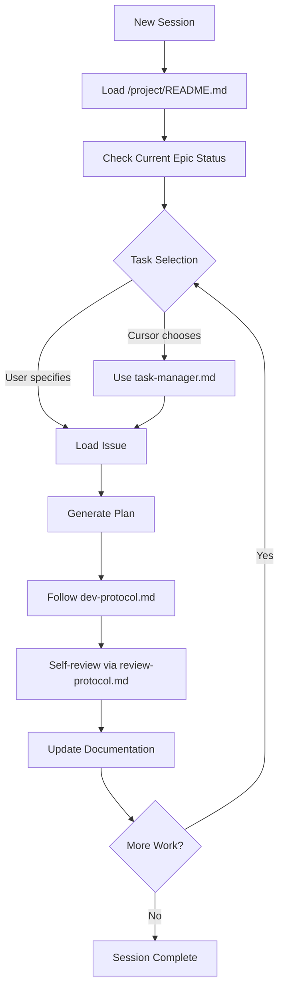

# Agentic Development Framework - Overview

**Project**: home-topology-ha
**Implemented**: 2025-12-10
**Status**: ✅ Complete and Ready to Use

---

## What Is This?

The Agentic Development Framework is a structured system for AI-assisted development that ensures:

- **Consistency** - Every Cursor session follows the same rules
- **Organization** - Work is tracked at multiple levels (epic → issue → task)
- **Quality** - Self-review protocols catch errors before they ship
- **Autonomy** - Cursor can select and prioritize tasks independently
- **Reusability** - Framework copies easily to future projects

---

## Framework Structure

```
project/
├── README.md                    # 🎯 START HERE - Master instruction file
├── QUICK-START.md              # 📖 Daily workflow guide
├── roadmap.md                  # 🗺️  Multi-week timeline
├── FRAMEWORK-OVERVIEW.md       # 📋 This file
│
├── agent/                      # 🤖 AI Behavior Protocols
│   ├── task-manager.md         #    How to select tasks
│   ├── dev-protocol.md         #    How to write code
│   └── review-protocol.md      #    How to review work
│
├── epics/                      # 📦 Feature-Level Tracking
│   ├── epic-template.md        #    Template for new epics
│   ├── epic-001-backend-integration.md
│   ├── epic-002-testing-coverage.md
│   └── epic-003-production-release.md
│
└── issues/                     # 📝 Task-Level Tracking
    ├── issue-template.md       #    Template for new issues
    └── (issues created as needed)
```

---

## The Three Levels of Work Tracking

```
┌─────────────────────────────────────────────────┐
│  ROADMAP (Multi-month timeline)                 │
│  └─> v0.1.0-alpha → v0.2.0-beta → v1.0.0       │
└──────────────────┬──────────────────────────────┘
                   │
        ┌──────────┴──────────┬──────────────┐
        ▼                     ▼              ▼
┌──────────────┐      ┌──────────────┐  ┌──────────────┐
│  EPIC-001    │      │  EPIC-002    │  │  EPIC-003    │
│  Backend     │      │  Testing     │  │  Production  │
│  Integration │      │  Coverage    │  │  Release     │
└──────┬───────┘      └──────────────┘  └──────────────┘
       │
       ├─> ISSUE-001: Wire WebSocket handlers
       ├─> ISSUE-002: Implement storage persistence
       ├─> ISSUE-003: Create event bridge
       ├─> ISSUE-004: Build timeout coordinator
       └─> ISSUE-005: Integration testing
```

---

## How It Works - The Agent Loop



---

## The Three Agent Protocols

### 1. Task Manager (`agent/task-manager.md`)

**Purpose**: How Cursor selects the next task

**Process**:

1. Load context (epics, issues, work-tracking.md)
2. Prioritize (blocked unblocking → in-progress → high priority → same epic)
3. Validate (no dependencies, clear criteria, accessible files)
4. Begin work (load epic/issue/ADRs, generate plan)

### 2. Dev Protocol (`agent/dev-protocol.md`)

**Purpose**: How Cursor writes code

**Key Rules**:

- Find similar code first (don't reinvent)
- Follow existing patterns exactly
- Integration translates, kernel implements
- Type hints required
- Use HA CSS variables (no hex colors)
- Changes should be < 500 lines

### 3. Review Protocol (`agent/review-protocol.md`)

**Purpose**: How Cursor reviews its own work

**Checklist**:

- ✅ Requirements verified
- ✅ Architecture aligned
- ✅ Code quality standards met
- ✅ Tests pass
- ✅ Documentation updated

---

## Current Epics

### EPIC-001: Backend Integration ⚡ ACTIVE

**Status**: 30% → Target 100%
**Target**: v0.1.0-alpha (Week of 2025-12-16)

**Goal**: Wire the integration layer to the home-topology kernel

**Issues**:

- ISSUE-001: Wire WebSocket handlers to LocationManager
- ISSUE-002: Implement location storage persistence
- ISSUE-003: Create event bridge (HA state → kernel)
- ISSUE-004: Build timeout coordinator
- ISSUE-005: Integration testing with live HA

---

### EPIC-002: Testing Coverage 🔜 PENDING

**Status**: 30% → Target 80%+
**Target**: v0.2.0-beta (January 2026)
**Blocked By**: EPIC-001

**Goal**: Comprehensive test coverage following "NO BS MOCK TESTS" philosophy

**Issues**:

- ISSUE-010: Unit tests for event_bridge.py
- ISSUE-011: Unit tests for coordinator.py
- ISSUE-012: Integration tests for full flow
- ISSUE-013: Expand frontend component tests
- ISSUE-014: Visual regression with Playwright

---

### EPIC-003: Production Release 🚀 PENDING

**Status**: 0% → Target 100%
**Target**: v1.0.0 (February 2026)
**Blocked By**: EPIC-001, EPIC-002

**Goal**: HACS-ready production release

**Issues**:

- ISSUE-020: Validate HACS manifest
- ISSUE-021: Write installation documentation
- ISSUE-022: Create configuration examples
- ISSUE-023: Set up GitHub release workflow
- ISSUE-024: Create user-facing README

---

## Integration with Existing Documentation

The framework **augments** existing docs, doesn't replace them:

| Framework                        | Existing Docs                      | Relationship                     |
| -------------------------------- | ---------------------------------- | -------------------------------- |
| `/project/README.md`             | `.cursorrules`                     | Framework references cursorrules |
| `/project/epics/`                | `docs/work-tracking.md`            | Epics break down sprints         |
| `/project/agent/dev-protocol.md` | `docs/coding-standards.md`         | Protocol references standards    |
| Epic ADR references              | `docs/adr-log.md`                  | Epics link to existing ADRs      |
| `/project/roadmap.md`            | `docs/work-tracking.md` milestones | Roadmap extracts from tracking   |

**Nothing was duplicated or moved.** The framework adds structure on top.

---

## Quick Commands Cheat Sheet

```bash
# Start session
"Load the Agentic Development Framework"

# Check status
"Show epic status and next priority task"

# Pick task
"Use task manager to select next task"

# Create issue
"Create issue for [task] in EPIC-001"

# Review work
"Self-review using review protocol"

# Update docs
"Mark ISSUE-001 complete and update work-tracking.md"
```

---

## Success Metrics

### Implementation Metrics

- ✅ 11 framework files created
- ✅ 3 agent protocols defined
- ✅ 3 epics with 15 identified issues
- ✅ .cursorrules updated with framework reference
- ✅ ~2,500 lines of structured documentation

### Expected Benefits

- 🎯 Clear task prioritization
- 🤖 Consistent AI behavior across sessions
- 🔍 Self-review reduces errors
- 📊 Progress visible at multiple levels
- 🔄 Reusable for future projects

---

## Next Steps

1. **Test the framework** in your next session:

   ```
   "Load the framework and show me EPIC-001 status"
   ```

2. **Create first issues** - Break down EPIC-001 tasks into issue files

3. **Start development** - Let Cursor select and work through tasks

4. **Iterate and improve** - Adjust templates and protocols as you learn

5. **Copy to next project** - When starting Life OS, Cabin Water, etc.

---

## For Future Projects

To apply this framework to a new project:

### Step 1: Copy Structure

```bash
cp -r project/ /path/to/new-project/project/
```

### Step 2: Customize

- Update `project/README.md` with new project context
- Create new epics for that project's work
- Update `roadmap.md` with new timeline

### Step 3: Integrate

- Add framework reference to `.cursorrules`
- Create first epic and issues
- Start first session with framework loaded

### Step 4: Evolve

- Adjust protocols based on project needs
- Add project-specific templates
- Update roadmap as work progresses

---

## Philosophy

> **"The framework is a scaffold, not a cage."**

Use it to:

- ✅ Maintain consistency
- ✅ Track complex work
- ✅ Guide AI behavior

Don't let it:

- ❌ Block quick changes
- ❌ Create bureaucracy
- ❌ Slow down iteration

If something feels too heavy, adjust it. The framework should serve you, not vice versa.

---

## Documentation Map

```
┌─────────────────────────────────────────────────────────┐
│  /project/ (Framework)                                   │
│  ├─ README.md          ← Master instructions for Cursor │
│  ├─ QUICK-START.md     ← Daily workflow guide           │
│  ├─ FRAMEWORK-OVERVIEW.md ← This file                   │
│  ├─ roadmap.md         ← Multi-week timeline            │
│  ├─ agent/*.md         ← AI behavior protocols          │
│  ├─ epics/*.md         ← Feature-level tracking         │
│  └─ issues/*.md        ← Task-level tracking            │
└─────────────────────────────────────────────────────────┘
                          │
                          │ references
                          ▼
┌─────────────────────────────────────────────────────────┐
│  /docs/ (Reference Documentation)                        │
│  ├─ architecture.md    ← System design                  │
│  ├─ coding-standards.md ← Code conventions              │
│  ├─ adr-log.md         ← Architecture decisions         │
│  ├─ work-tracking.md   ← Sprint status (daily updates)  │
│  └─ cursor-guide.md    ← Detailed patterns              │
└─────────────────────────────────────────────────────────┘
```

---

**Ready to use!** Start your next session with:

```
"Load the Agentic Development Framework and let's get started."
```

---

**Last Updated**: 2025-12-10
**Version**: 1.0.0
**Maintainer**: Mike
